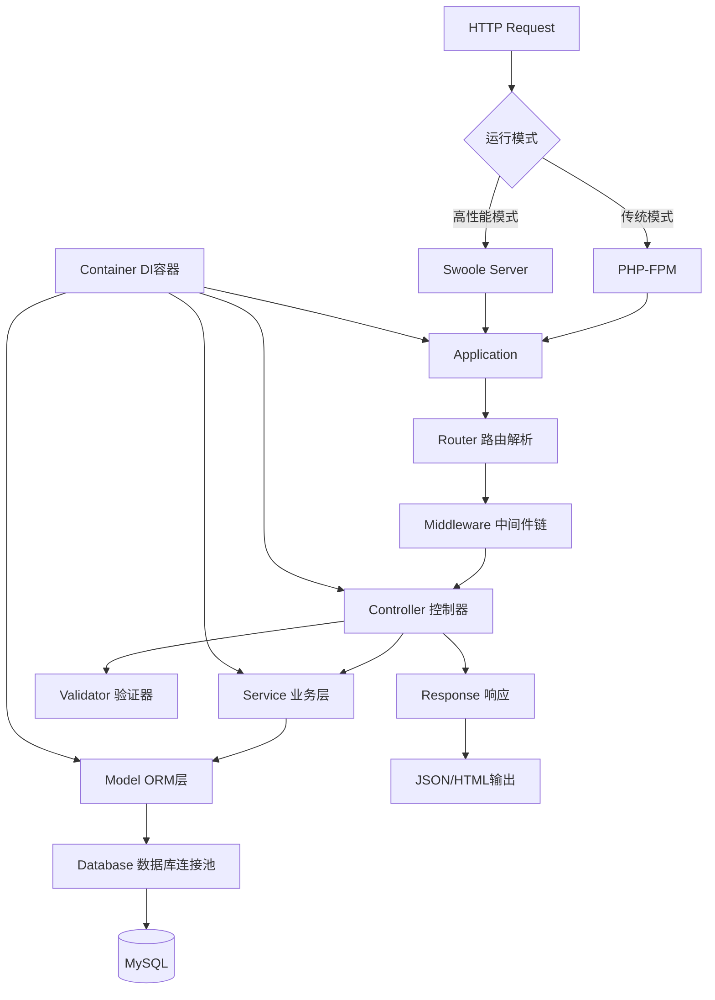
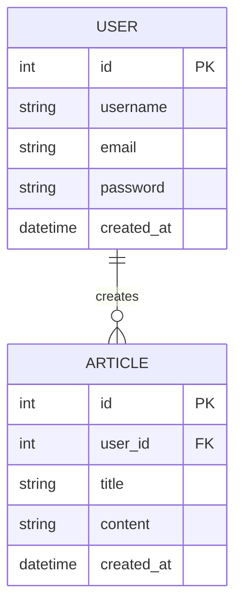

# 轻量级 PHP 框架设计文档

## 系统架构



## ER 图（示例应用）



## 核心特性

### 1. 架构设计
- **PSR 规范支持**：PSR-4 自动加载、PSR-7 HTTP消息、PSR-11 容器接口
- **DI 容器**：基于反射的依赖注入，支持单例、工厂模式
- **接口化设计**：所有核心组件都基于接口，便于扩展和测试

### 2. 易用性
- **约定优于配置**：默认路由规则、默认目录结构
- **简洁 API**：链式调用、流畅接口
- **中文注释**：所有代码包含详细中文注释

### 3. 开发效率
- **内置 CRUD**：Model 提供 save/delete/find 等快捷方法
- **验证器**：内置常用验证规则，支持自定义规则
- **分页器**：自动分页，支持多种分页样式

### 4. 性能优化
- **轻量级核心**：核心代码精简，按需加载
- **路由缓存**：支持路由规则缓存，减少解析开销
- **懒加载**：组件按需实例化，减少内存占用

### 5. 高并发支持
- **Swoole 协程**：原生支持 Swoole HTTP Server
- **连接池**：数据库连接池，复用连接，减少开销

## 接口清单

### 核心接口

#### Application
- `run()` - 启动应用
- `handle(Request $request): Response` - 处理请求

#### Router
- `get(string $path, callable|string $handler): Route` - 注册 GET 路由
- `post(string $path, callable|string $handler): Route` - 注册 POST 路由
- `match(string $method, string $path, callable|string $handler): Route` - 注册路由
- `dispatch(Request $request): ?Route` - 路由分发

#### Container
- `bind(string $abstract, callable|string $concrete): void` - 绑定服务
- `singleton(string $abstract, callable|string $concrete): void` - 单例绑定
- `make(string $abstract): mixed` - 解析服务
- `has(string $abstract): bool` - 检查服务是否存在

#### Model
- `find(int $id): ?Model` - 查找单条记录
- `where(string $field, $value): Query` - 条件查询
- `save(): bool` - 保存记录
- `delete(): bool` - 删除记录
- `paginate(int $pageSize = 15): Paginator` - 分页查询

#### Validator
- `validate(array $data, array $rules): bool` - 验证数据
- `errors(): array` - 获取错误信息

## UI/UX 规范（示例应用）

### 主色调
- 主色：`#409EFF`（Element Plus 默认蓝）
- 成功：`#67C23A`
- 警告：`#E6A23C`
- 危险：`#F56C6C`

### 字体
- 主字体：`-apple-system, BlinkMacSystemFont, "Segoe UI", Roboto, "Helvetica Neue", Arial`
- 字号：12px（小）、14px（默认）、16px（中）、18px（大）、20px（标题）

### 卡片样式
- 圆角：`8px`
- 阴影：`0 2px 12px 0 rgba(0, 0, 0, 0.1)`
- 内边距：`16px` / `24px`

### 间距规范
- 基础间距：`8px` 的倍数（8px、16px、24px、32px）

## 目录结构

```
.
├── backend/                    # 框架核心
│   ├── src/
│   │   ├── Core/              # 核心类
│   │   │   ├── Application.php
│   │   │   ├── Container.php
│   │   │   ├── Router.php
│   │   │   └── ...
│   │   ├── Http/              # HTTP 相关
│   │   │   ├── Request.php
│   │   │   ├── Response.php
│   │   │   └── Middleware.php
│   │   ├── Database/           # 数据库层
│   │   │   ├── Connection.php
│   │   │   ├── ConnectionPool.php
│   │   │   ├── Model.php
│   │   │   └── Query.php
│   │   ├── Validation/         # 验证器
│   │   │   └── Validator.php
│   │   └── Support/            # 辅助类
│   ├── examples/               # 示例应用
│   ├── composer.json
│   └── Dockerfile
├── docker-compose.yml
├── .gitignore
└── README.md
```
